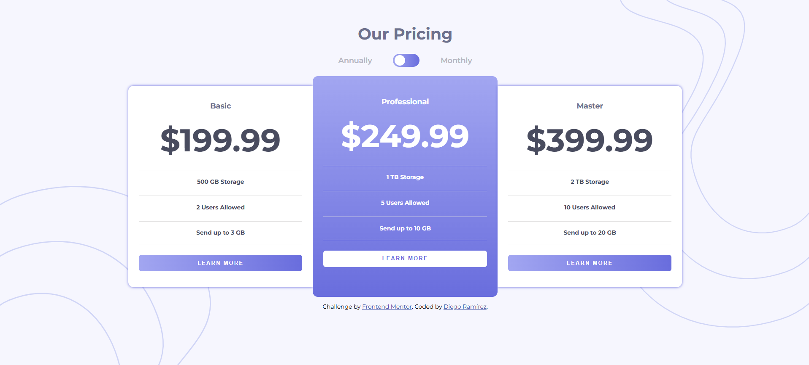

# Frontend Mentor - Pricing component with toggle solution

This is a solution to the [Pricing component with toggle challenge on Frontend Mentor](https://www.frontendmentor.io/challenges/pricing-component-with-toggle-8vPwRMIC). Frontend Mentor challenges help you improve your coding skills by building realistic projects. 

## Table of contents

- [Overview](#overview)
  - [The challenge](#the-challenge)
  - [Screenshot](#screenshot)
  - [Links](#links)
- [My process](#my-process)
  - [Built with](#built-with)
  - [What I learned](#what-i-learned)
  - [Continued development](#continued-development)
- [Author](#author)

## Overview

### The challenge

Users should be able to:

- View the optimal layout for the component depending on their device's screen size
- Control the toggle with both their mouse/trackpad and their keyboard
- **Bonus**: Complete the challenge with just HTML and CSS

### Screenshot



### Links

- Solution URL: [Github](https://github.com/Diego2Drm/pricing-component-with-toggle)
- Live Site URL: [pricing-component-with-toggle](https://diego2drm.github.io/pricing-component-with-toggle/)

## My process

### Built with

- Semantic HTML5 markup
- CSS custom properties
- Flexbox
- Mobile-first workflow

### What I learned

Use input checked

```html
  <label>
    <input type="checkbox" name="" id="">
    <span></span>
  </label>
```
```css
header label {
  border-radius: 3rem;
  width: 5rem;
  height: 2.5rem;
  position: relative;
  display: flex;
  align-items: center;
  justify-content: center;
  cursor: pointer;
  background: var(--linear-gradient);
}

header label input {
  appearance: none;
}

header label span {
  display: inline-block;
  width: 2rem;
  height: 2rem;
  border-radius: 50%;
  background: #fff;
  position: absolute;
  left: .3rem;
  transition: all 0.5s ease-in-out;
}

header label input:checked~span {
  /* right: .3rem; */
  /* translate: 2.2rem; */
  left: 2.7rem;
}

header:has(input:checked)~main .content__basic--price-monthly,
header:has(input:checked)~main .content__professional--price-monthly,
header:has(input:checked)~main .content__master--price-monthly {
  display: flex;
}

header:has(input:checked)~main .content__basic--price-anually,
header:has(input:checked)~main .content__professional--price-anually,
header:has(input:checked)~main .content__master--price-anually {
  display: none;
}
```
### Continued development

- Css 3 --> Avanced 

## Author

- Website - [Diego Ramírez](https://diego2drm.github.io/Portafolio/)
- Frontend Mentor - [@Diego2Drm](https://www.frontendmentor.io/profile/Diego2Drm)
- Gmail - [diego.ramirez2d03@gmail.com]

